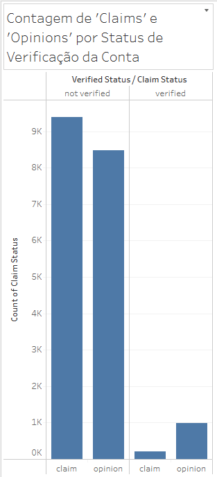
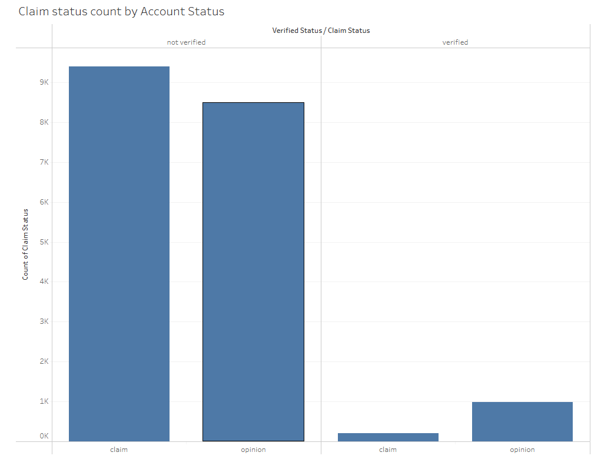

# Comparação do impacto entre contas verificadas e não verificadas nas visualizações de vídeos no TikTok

## Overview

Existe uma suspeita de que contas **não verificadas** atraem mais visualizações para os posts pelo fato de postarem `claims`(alegações) que são opiniões não fundadas e não baseadas em fatos.

Uma análise exploratória feita destacou que maior parte dos vídeos postados por contas não verificadas são categorizadas como `claim`. **Análise abaixo**.

Fonte: [Tableu EDA Dashboard](https://public.tableau.com/app/profile/bruno5659/viz/TikTokCapstoneProject-E_D_A/Story1#1)

O que gera uma preocupação com relação a veracidade de fatos na plataforma.

O primeiro passo é analisar se existe uma diferença significativa na média de visualizações entre **contas verificadas** e **não verificadas**. Para isso, irei comparar as médias de visualizações dos dois grupos e aplicar testes estatísticos para verificar se essa diferença é estatisticamente relevante, ou seja, se não ocorreu apenas **por acaso**. Assim, poderemos entender se o status de verificação realmente poderia ser um fator que influencia o alcance dos vídeos.

## Detalhes Técnicos:

**Cada linha neste dataset representa um vídeo** e as métricas gerais deste vídeo como quantidade de visualizações, comentários, compartilhamentos e outros.

### Dicionário dos dados:

#### Colunas

- **#**: Índice ou identificador único para cada registro.
- **claim_status**: Status da reivindicação relacionada ao vídeo.
- **video_id**: Identificador único para cada vídeo.
- **video_duration_sec**: Duração do vídeo em segundos.
- **video_transcription_text**: Transcrição do conteúdo de áudio do vídeo.
- **verified_status**: Indica se a conta é verificada ou não.
- **author_ban_status**: Status indicando se o autor está banido.
- **video_view_count**: Número de visualizações que o vídeo recebeu.
- **video_like_count**: Número de curtidas que o vídeo recebeu.
- **video_share_count**: Número de vezes que o vídeo foi compartilhado.
- **video_download_count**: Número de vezes que o vídeo foi baixado.
- **video_comment_count**: Número de comentários no vídeo.

#### Tecnologias utilizadas

* Python (Pyenv, Pandas, Numpy, Matplotlib, Seaborn, Scipy)
* Github
* Tableu Public (Para algumas visualizações e exploratórias como a utilizada no primeiro parágrafo)

### Executive Summary

A análise do conjunto de dados revelou que as contas `não verificadas` apresentam a maior média de `view_count`. Com uma diferença de `48,79%`, isso sugere um impacto considerável no total de visualizações de vídeo para esse tipo de conta.

E após testar a significância estatística, obtendo um p-valor `< 0.001`, foi possível rejeitar a hipótese nula, confirmando que a diferença na média de visualizações é estatisticamente significante.

Baseado nisso as suspeitas iniciais se confirmam, de que essas contas realmente atraem um número maior de visualizações podendo gerar uma influência em potencial de forma negativa para os espectadores e consequentemente para a plataforma. 

### Próximos Passos (Next Steps)

O próximo passo deste projeto será desenvolver um modelo de Regressão Logística para aprofundar a análise. O objetivo é criar um sistema de classificação capaz de prever se um vídeo foi postado por uma conta verificada ou não verificada (verified_status), utilizando como base as métricas de engajamento e características do próprio vídeo, como a contagem de visualizações, curtidas e sua duração.

Vídeos com alta probabilidade de virem de contas não verificadas podem ser automaticamente sinalizados para uma equipe de moderação, permitindo uma ação mais rápida para mitigar a disseminação de desinformação.

### Resultados da Regressão (in progress)

