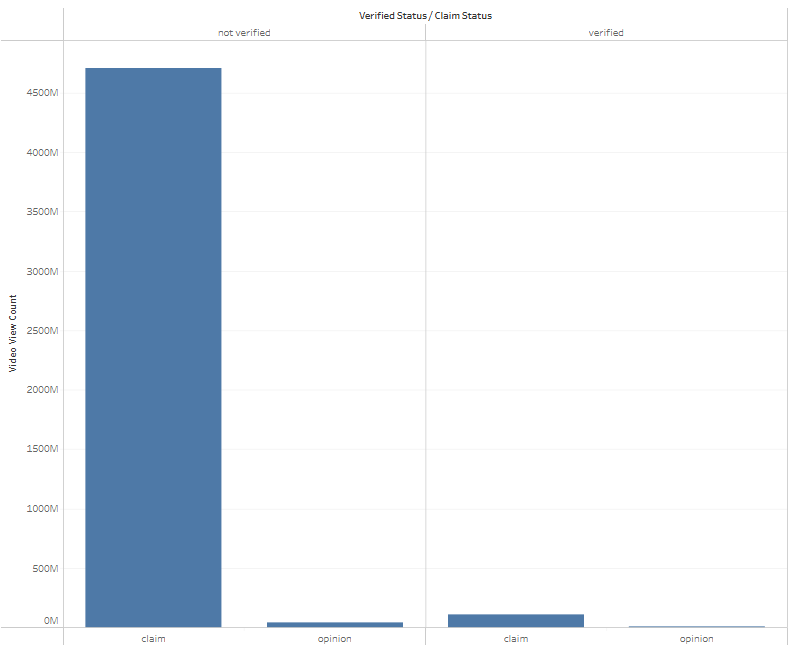
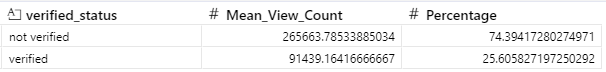

# Construção de um modelo de regressão logística para previsão de contas com potencial de 

## Overview

Existe uma preocupação da plataforma **TikTok** sobre videos que possam espalhar informações falsas.
Uma análise exploratória feita destacou que maior parte dos vídeos postados por contas não verificadas são categorizadas como `claim`. **Gráfico abaixo**.

_Fonte: [Tableu E.D.A Dashboard](https://public.tableau.com/app/profile/bruno5659/viz/TikTokCapstoneProject-E_D_A/Story1#1)_

Uma `claim` é uma alegação, que não necessariamente possui realmente evidências, que é apresentado por alguém como um fato, podendo ser uma forma de convencer pessoas sobre algum ponto que `não necessariamente é uma verdade` o que pode ser prejudicial principalmente se esses vídeos atingirem um grande número de pessoas.

O Objetivo é investigar:

* Videos categorizados como claim atraem mais views?
* Caso haja diferença, essa diferença pode ter acontecido por acaso?
* Se a hipótese de que existe uma real diferença na quantidade de visualizações,for confirmada, como prever se um vídeo pode ser prejudicial e agir de forma mais ágil antes que haja um impacto?

Segue os resultados das análises no executivo abaixo, e detalhes técnicos no final.

### Executive Summary

Tentando entender melhor o engajamento, segmentado pelas categorias `verified status` e `claim status`, identifiquei uma diferença notória nas visualizações para contas `não verificadas` categorizadas como `claim`. **Gráfico abaixo**.

_Fonte: [Tableu E.D.A Dashboard](https://public.tableau.com/app/profile/bruno5659/viz/TikTokCapstoneProject-E_D_A/Story1#1)_

Comparando a média de visualizações entre contas verificadas e não verificadas, revelou-se também que as contas `não verificadas` apresentam maior média de visualizações, com uma diferença de `48,79%` das contas verificadas, que confirmou-se estatisticamente através de um teste de hipótese.

Baseado nisso as suspeitas iniciais se confirmam, de que essas contas realmente atraem um número maior de visualizações podendo gerar uma influência em potencial de forma negativa para os espectadores e consequentemente para a plataforma.

## Detalhes Técnicos:

**Cada linha neste dataset representa um vídeo** e as métricas gerais deste vídeo como quantidade de visualizações, comentários, compartilhamentos e outros.

### Dicionário dos dados:

#### Colunas

- **#**: Índice ou identificador único para cada registro.
- **claim_status**: Status da reivindicação relacionada ao vídeo.
- **video_id**: Identificador único para cada vídeo.
- **video_duration_sec**: Duração do vídeo em segundos.
- **video_transcription_text**: Transcrição do conteúdo de áudio do vídeo.
- **verified_status**: Indica se a conta é verificada ou não.
- **author_ban_status**: Status indicando se o autor está banido.
- **video_view_count**: Número de visualizações que o vídeo recebeu.
- **video_like_count**: Número de curtidas que o vídeo recebeu.
- **video_share_count**: Número de vezes que o vídeo foi compartilhado.
- **video_download_count**: Número de vezes que o vídeo foi baixado.
- **video_comment_count**: Número de comentários no vídeo.

#### Tecnologias utilizadas

* Python (Pyenv, Pandas, Numpy, Matplotlib, Seaborn, Scipy)
* Github
* Tableu Public (Para algumas visualizações e exploratórias como a utilizada no primeiro parágrafo)

### Próximos Passos (Next Steps)

O próximo passo deste projeto será desenvolver um modelo de Regressão Logística para aprofundar a análise. O objetivo é criar um sistema de classificação capaz de prever se um vídeo foi postado por uma conta verificada ou não verificada (verified_status), utilizando como base as métricas de engajamento e características do próprio vídeo, como a contagem de visualizações, curtidas e sua duração.

Vídeos com alta probabilidade de virem de contas não verificadas podem ser automaticamente sinalizados para uma equipe de moderação, permitindo uma ação mais rápida para mitigar a disseminação de desinformação.

### Resultados da Regressão

Após as considerações, devemos olhar então para a coluna **_Odds_Ratio_not_verified_**

A Variável `author_ban_status_banned` ou seja, uma conta que foi banida, indica um grande impacto na conta ser `não verificada` seguida pela variável `author_ban_status_under review` o que reforça a ideia de que essas contas tendem a postar vídeos de conteúdo questionável e devem ser monitoradas, de fato. Em contra partida a variável `claim_status_opinion` nos diz que quando um post se refere a uma opinião, a chance de a conta ser não verificada cai drásticamente, como suspeitado desde o início.

O modelo de Regressão Logística demonstrou uma forte capacidade de cumprir o objetivo principal do projeto: identificar contas não verificadas. A performance do modelo para esta classe atingiu um recall de **83%** (também conhecido como Especificidade), provando sua eficácia em encontrar a grande maioria do público-alvo. 

Este alto poder de detecção resultou em uma precisão de 64%, indicando a presença de alguns falsos alarmes, porém ainda é melhor do que uma escolha randômica que teria 50% de chances de acerto. No entanto, o F1-Score de 72% confirma que o modelo possui um desempenho geral robusto e equilibrado para esta tarefa específica, estabelecendo um excelente baseline para futuras otimizações.